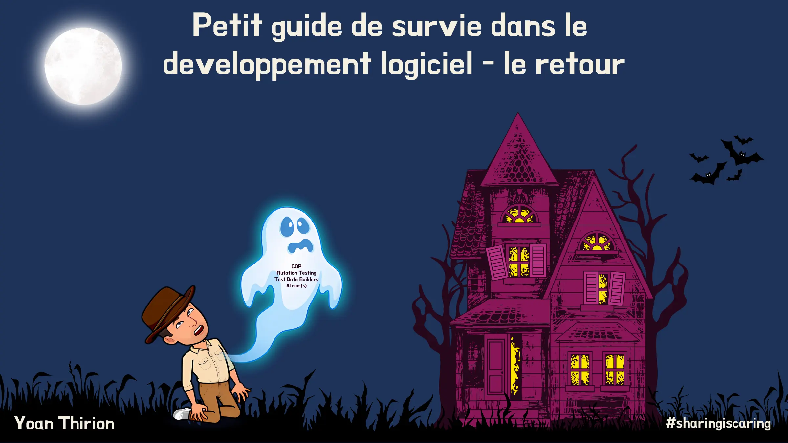

# Petit guide de survie dans le développement logiciel (partie 2)

## Plan
Durant cette session mélangeant interactions, théorie et live coding je vous propose de découvrir certaines pratiques techniques peu connues ou méconnues mais qui peuvent sauver des vies.

Par "sauver des vies", j’entends permettre aux développeur·euses d’être encore plus efficaces et confiants au quotidien.

Ainsi nous creuserons ensemble :

- [Les communautés de pratique](#communautés-de-pratique)
- [Le Mutation Testing](#mutation-testing)
- [Test Data Builders](#test-data-builders)
- [Les Xtrems (Reading, Watch)](#xtrems)

Vous repartirez avec le plein d’envie d’expérimentation et d’idées.

## Communautés de pratique

## Mutation Testing

## Test Data Builders

## Xtrems

## "Solution"
Pour chaque pratique technique, ce repository contient 1 exemple de code ainsi qu'une proposition de solution utilisant la technique spécifiée dans le répertoire `solution`.

## Board Mural
[Export board mural](files/mural-partie2.pdf)